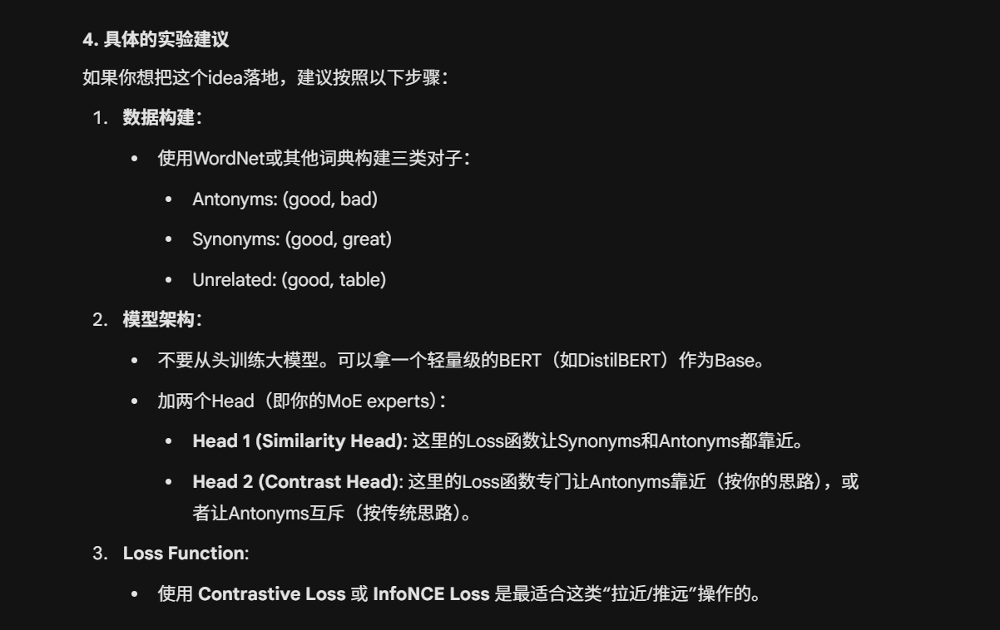

- 我的这个想法命中了一个痛点：
    - 语义相似（Synonyms）和语义相反（Antonyms）的词往往拥有极度相似的上下文（Context）
- 不能按照原本的想法做，太简单了
    - 如果你坚持 “越相反越近”（即把Encoder B做成一个“差异检测器”），这也是可行的，但这更像是一个**Metric Learning（度量学习）**任务。
- 研究一个相近的概念
    - Counter-fitting
        - https://aclanthology.org/N16-1018/
        - 这个是强行设计了三个公式，分别让反义词更远，同义词更近，保持和原本距离不太远
            - 最后还是一个 embedding
    - distributional hypothesis
        - the assumption that semantically similar or related words appear in similar contexts

### 问题
- 我要怎么做 polarity 的 encoder


- 反义词 encoder 设计
```
方案一：正交子空间（Orthogonal Subspace）Encoder A (Topic): 越相关越近。Distance(Good, Bad) -> 近 (都是评价词)Distance(Good, Apple) -> 远Encoder B (Polarity): 语义越相反，距离越远（或者呈负相关）。我们将这个空间设计为一维或低维的“极性轴”。Vector(Good) 指向 +1 方向。Vector(Bad) 指向 -1 方向。判定逻辑:如果 A 空间距离 < Threshold (说明相关) AND B 空间距离 > Threshold (说明极性相反) $\rightarrow$ 反义词。如果 A 空间距离 < Threshold AND B 空间距离 < Threshold $\rightarrow$ 近义词。
```

- 实验设计


- 三个让它变复杂，可以投 emnlp 的方法


- 两个方向可以做

# RAG 的 Hard Negative 问题

# LLM 的 Rpresentation Engineering
